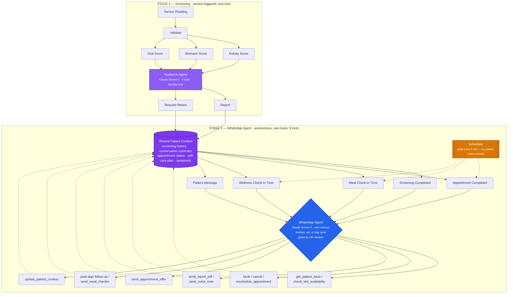

# Novera — Dual-Agent Architecture: Guidance Agent + Autonomous WhatsApp Agent

**Status:** Design spec, ready to build
**Supersedes:** The single-orchestrator merge proposal from the previous session. This version keeps the two agents architecturally separate but gives WhatsApp Agent full autonomy and its own proactive triggers, rather than merging into one shared orchestrator.

---

## 0. The shift in one sentence

Guidance Agent stays a **narrow, one-shot screening specialist**. WhatsApp Agent becomes a **fully autonomous, standing agent** with its own brain, its own memory, and its own reasons to reach out that have nothing to do with waiting for a message. Appointment handling and voice generation move entirely out of Guidance Agent and become native WhatsApp Agent tools.

---

## 1. The complete workflow — everything, end to end

This is the whole system as one connected loop, not two separate diagrams. Renders natively on GitHub, in VS Code, and in most Markdown viewers — if yours doesn't render Mermaid, the plain-text version right below it covers the same ground.



**Plain-text version of the same flow**, for anywhere Mermaid doesn't render:

```
STAGE 1 — SCREENING (sensor-triggered, one-shot)
──────────────────────────────────────────────────
Sensor Reading → Validate → ┬─ Kidney Score  ─┐
                             ├─ Stomach Score ─┼─→ Guidance Agent ─┬─→ Report
                             └─ Oral Score    ─┘   (4 tools,       └─→ Request Retest
                                                     decides only)
                                                          │
                                                          ▼
STAGE 2 — SHARED MEMORY (every trigger reads + writes here)
──────────────────────────────────────────────────
        ┌─────────────────────────────────────────────────┐
        │            Shared Patient Context                │
        │  screening history · conversation summary ·      │
        │  appointment status · self-care plan · symptoms  │
        └─────────────────────────────────────────────────┘
              │        │         │         │         │
              ▼        ▼         ▼         ▼         ▼
STAGE 3 — WHATSAPP AGENT (autonomous, own brain, 5 triggers, 9 tools)
──────────────────────────────────────────────────
        Screening   Appointment   Meal        Wellness    Patient
        Completed   Completed     Check-in    Check-in    Message
            │             ▲          ▲           ▲            │
            │             │          │           │            │
            │        ┌────┴──────────┴───────────┴────┐       │
            │        │   Scheduler (polls every 5 min)  │      │
            │        │   — no patient action needed —   │      │
            │        └──────────────────────────────────┘      │
            └─────────────┬────────────────────────────────────┘
                           ▼
              ┌──────────────────────────────┐
              │        WhatsApp Agent          │
              │   Claude Sonnet 5 · own memory │
              │  decides: act, or stay quiet   │
              │   — gated by 24h window —      │
              └──────────────┬─────────────────┘
                              │
        ┌─────────┬─────────┬┴────────┬─────────┬─────────┐
        ▼         ▼         ▼         ▼         ▼         ▼
   get_patient  book/    send_report  send_     post-appt  update_
   _facts /     cancel/  _pdf /       appt_     followup/  patient_
   check_slot   reschd.  send_voice   offer     meal_       context
                                                  checkin
        │         │         │         │         │         │
        └─────────┴─────────┴─────────┴─────────┴─────────┘
                              │
                              ▼
              (writes back into Shared Patient Context —
               every future trigger inherits this, closing the loop)
```

The loop is the whole point: nothing in Stage 3 is a dead end. Every tool call feeds back into the same Patient Context that every future trigger — human-initiated or clock-initiated — reads from first.

---

## 2. Guidance Agent — narrowed scope

### What it does now
A single reading comes in → it validates → scores three organ systems → decides between two outcomes. That's the whole job.

```
Sensor Reading → Validate → [Kidney Score, Stomach Score, Oral Score] → Guidance Agent → Report | Request Retest
```

### Tools (down from 6 to 4)

| Tool | Purpose | Removed? |
|---|---|---|
| `run_screening_pipeline` | Always first. Validates reading, scores kidney/stomach/oral, returns prediction + confidence + flag | Kept |
| `generate_report` | Plain-language screening report | Kept |
| `request_retest` | Flags the case if screening failed/inconclusive | Kept |
| ~~`generate_voice_script`~~ | — | **Removed → moves to WhatsApp Agent as `send_voice_note`** |
| ~~`offer_clinic_appointment`~~ | — | **Removed → moves to WhatsApp Agent, no longer hardcoded-generic** |
| ~~`generate_self_care_plan`~~ | — | **Removed → moves to WhatsApp Agent, generated contextually inside conversation, not pre-baked** |

### What it hands off

When Guidance Agent finishes a run, it writes one thing and stops:

```python
class ScreeningResult(TypedDict):
    patient_id: str
    timestamp: datetime
    organ_scores: dict[str, float]       # kidney, stomach, oral
    flag: Literal["low", "medium", "high"]
    confidence: float
    report_text: str | None
    needs_retest: bool
```

This gets written to the shared Patient Context (§3.4) and fires an internal event (`screening.completed`). Guidance Agent's job ends there — it does not decide whether to message the patient, when, or how. That responsibility belongs entirely to WhatsApp Agent now.

### Diagram implications

The homepage `liveWorkflow.js` diagram now ends at **Report** or **Request Retest** — no Appointment node, no Voice node on this lane. Those visuals move to a new WhatsApp lane (§7).

---

## 3. WhatsApp Agent — full autonomy

This is the core of the redesign. WhatsApp Agent is no longer "the thing that replies to messages." It is a standing agent with:

- its own chat model
- its own persistent memory (full patient history, not just the current exchange)
- its own tool belt (9 tools)
- **five independent ways to wake up**, only one of which is "patient sent a message"

### 3.1 The five triggers

| # | Trigger | Fires when | Requires patient action? |
|---|---|---|---|
| 1 | `screening.completed` | Guidance Agent finishes a run | No |
| 2 | `appointment.completed` | A booked appointment's time has passed | No |
| 3 | `mealtime.checkin` | Scheduler reaches a patient's configured meal-check window | No |
| 4 | `wellness.checkin` | Scheduler reaches a patient's configured wellness-check cadence | No |
| 5 | `whatsapp.inbound` | Patient sends a message | Yes — the only reactive trigger |

**Four out of five require nothing from the patient.** This is what makes the agent genuinely proactive rather than a well-disguised webhook handler. An agent that can only ever respond to input is not agentic, no matter how good its responses are — the defining trait is the ability to act without being prompted.

### 3.2 The Scheduler — the mechanism that makes triggers 2–4 possible

Without something checking the clock independently of any request, an agent has no way to notice "it's been 3 days since the appointment" or "it's lunchtime." This needs to be a real background process, not a cron job bolted on as an afterthought.

```python
# core/scheduler.py — runs continuously, independent of any inbound request

async def scheduler_loop():
    while True:
        now = datetime.utcnow()

        # Trigger 2: appointment completed
        for appt in get_appointments_ending_around(now):
            if not appt.followup_sent:
                await enqueue_trigger("appointment.completed", patient_id=appt.patient_id)

        # Trigger 3: meal check-in windows
        for patient in get_patients_with_active_plan():
            if is_mealtime_window(patient, now) and not already_checked_in_today(patient, "meal"):
                await enqueue_trigger("mealtime.checkin", patient_id=patient.id)

        # Trigger 4: wellness check-in cadence
        for patient in get_patients_needing_wellness_checkin(now):
            await enqueue_trigger("wellness.checkin", patient_id=patient.id)

        await asyncio.sleep(300)  # check every 5 minutes — cheap, no reason to poll faster
```

Each `enqueue_trigger` call wakes the WhatsApp Agent with a specific context payload, the same way an inbound message would. The agent doesn't know or care whether it was woken by a human or a clock — it receives context, checks what tools are available, and acts.

### 3.3 The brain

```python
# core/whatsapp_agent.py

class WhatsAppAgent:
    model = "claude-sonnet-5"   # chat model doing the reasoning + tool selection

    def __init__(self, patient_context: PatientContext):
        self.context = patient_context
        self.tools = self._available_tools()  # gated — see §5

    async def handle(self, trigger: str, payload: dict):
        system_prompt = build_system_prompt(self.context, trigger)
        response = await self.model.bind_tools(self.tools).ainvoke(
            system_prompt, trigger_context=payload
        )
        # model decides: which tool(s) to call, what to say, whether to say anything at all
        return response
```

Critically: **being triggered doesn't mean it has to message the patient.** A `wellness.checkin` trigger might fire, the agent might check `get_patient_facts`, see the patient already reported feeling fine two hours ago in an unrelated message, and decide to do nothing. Restraint is part of the intelligence here — an agent that messages on every trigger regardless of context reads as spam, not care.

### 3.4 Memory — what "its own memory" actually means

Not just the current conversation thread. WhatsApp Agent's memory spans:

```python
class PatientContext(TypedDict):
    patient_id: str

    # From Guidance Agent
    latest_screening: ScreeningResult | None
    screening_history: list[ScreeningResult]

    # Conversation state
    conversation_summary: str          # rolling summary, not full transcript — keeps context small
    last_inbound_at: datetime | None   # drives the 24h window gate, see §5
    last_outbound_at: datetime | None

    # Appointments
    appointment_status: Literal["none", "offered", "booked", "completed", "no_show"]
    appointment_time: datetime | None
    followup_sent: bool

    # Care plan
    self_care_plan: str | None
    self_care_plan_issued_at: datetime | None
    last_meal_checkin_at: datetime | None
    last_meal_checkin_response: str | None

    # Wellness
    last_wellness_checkin_at: datetime | None
    wellness_checkin_cadence_days: int   # configurable, not hardcoded — see §8 open question
    reported_symptoms: list[dict]         # anything concerning the patient has mentioned
```

Every tool call ends by writing back into this object (`update_patient_context`, tool #9 below). This is what lets the agent say something like *"Last time we talked you mentioned you hadn't started the potassium-reduced diet yet — did that change?"* instead of treating every conversation as if it's the first one.

---

## 4. The 9 tools

| # | Tool | What it does | New or existing |
|---|---|---|---|
| 1 | `get_patient_facts` | Reads full Patient Context — screening history, appointments, conversation summary, symptoms | Existing |
| 2 | `check_slot_availability` | Read-only clinic calendar query | Existing |
| 3 | `book_appointment` / `cancel_appointment` / `reschedule_appointment` | Real DB writes against the clinic schedule | Existing |
| 4 | `send_report_pdf` | Generates and sends the screening report document | Existing |
| 5 | `send_voice_note` | **New.** Converts a message into a spoken WhatsApp voice note — moved here from Guidance Agent's `generate_voice_script`, now generated in-context instead of pre-scripted | New (moved) |
| 6 | `send_appointment_offer` | **New.** Replaces the old hardcoded `offer_clinic_appointment`. Generates a real, contextual offer referencing the actual flagged organ system, gated by the 24h window (§5) | New |
| 7 | `send_post_appointment_followup` | **New.** Fires from the `appointment.completed` trigger — asks how it went, whether they have questions, whether they want the report resent | New |
| 8 | `send_meal_checkin` | **New.** Fires from `mealtime.checkin` — asks whether the patient followed the self-care plan's food guidance today, logs the answer | New |
| 9 | `update_patient_context` | **New.** Every other tool call should end by calling this — writes whatever was learned (a symptom mentioned, a meal skipped, a preference stated) back into Patient Context | New |

Tool #9 is the one most projects skip and most regret skipping. Without it, every trigger starts from a stale picture of the patient and the "memory" claim doesn't actually hold up under use.

---

## 5. The 24-hour window — a hard gate, not a prompt instruction

<cite index="43-1">Meta requires business-initiated messages sent outside a 24-hour window since the customer's last message to use a pre-approved template; free-form text outside that window will fail or risk the account.</cite> This cannot be left to the model's judgment — it has to be enforced in code, before the model ever sees which tools are available:

```python
def available_send_tools(context: PatientContext) -> list[Tool]:
    within_24h = (
        context["last_inbound_at"] is not None
        and datetime.utcnow() - context["last_inbound_at"] < timedelta(hours=24)
    )
    if within_24h:
        return [send_freeform_message, send_voice_note, send_report_pdf]
    else:
        return [send_template_message]  # model picks template + fills variables only
```

Every one of the four proactive triggers (screening completed, appointment completed, meal check-in, wellness check-in) is, by definition, business-initiated — the patient didn't just message. So **unless the patient has messaged within the last 24 hours, every proactive outreach must go through `send_template_message`**, using a pre-approved template with variables filled from context. Free-form generation only becomes available once the patient has actually replied and a real conversation is open.

This means you need a small library of approved templates ahead of time — at minimum:
- `appointment_offer` (references the flagged organ system)
- `appointment_followup` (post-visit check-in)
- `meal_checkin` (asks about the self-care plan)
- `wellness_checkin` (general how-are-you-feeling)
- `retest_reminder`

The model chooses *which* template fits the trigger and fills in the variables — it does not write new template text on the fly outside the window.

---

## 6. Safety floor — kept, relocated

The old hardcoded guarantee ("medium/high flag → patient gets contacted, no exceptions") was correct and should not become optional just because the system got smarter. It moves from Guidance Agent into a deterministic wrapper around WhatsApp Agent's trigger handling:

```python
def enforce_outreach_guarantee(context: PatientContext) -> bool:
    """Forced, not suggested. Runs before the model gets a turn."""
    if context["latest_screening"] and context["latest_screening"]["flag"] in ("medium", "high"):
        hours_since_contact = _hours_since(context["last_outbound_at"])
        if hours_since_contact is None or hours_since_contact > 24:
            force_send_appointment_offer(context)
            return True
    return False
```

The model retains discretion over tone, what else to bundle into the message, whether to also offer a voice note — but it cannot skip contacting a flagged patient. Same guarantee as before, now expressed as a forced call into the new tool set instead of a single generic hardcoded tool.

---

## 7. Diagram changes

- **Guidance Agent lane** (existing, unchanged event names): Sensor Reading → Validate → [Kidney / Stomach / Oral Score] → Guidance Agent → **Report | Request Retest**. Appointment and Voice nodes are removed from this lane entirely.
- **New WhatsApp Agent lane**, parallel and independent: five trigger nodes (Screening Completed, Appointment Completed, Meal Check-in, Wellness Check-in, Patient Message) feeding into a WhatsApp Agent brain node (chat model + memory + 9-tool badge), fanning out to the 9 tools, with a visible loop-back edge from `update_patient_context` into the memory block.
- **New WebSocket namespace**, additive only — do not rename or touch the existing pipeline events:
  - `whatsapp.trigger_fired` (which of the 5, and why)
  - `whatsapp.tool_called`
  - `whatsapp.message_sent`
  - `whatsapp.context_updated`
- Either a second socket or a `channel: "whatsapp"` field on the existing `/ws/pipeline` events so the frontend can filter into a second visual lane without disturbing the first.

---

## 8. Open product decision — flag, don't guess

**Meal and wellness check-in cadence is a real product decision, not a technical one, and shouldn't be invented here.** How often is caring and how often is intrusive depends on things only you can judge: how sick the patient's flag is, how the app is meant to feel, what patients have actually said about frequency. `wellness_checkin_cadence_days` is left as a configurable field in Patient Context specifically so this can be tuned per-patient or globally without a code change once you've decided — but the number itself needs a real answer before this ships, not a placeholder guess baked into the spec.

---

## 9. Build order

1. Strip Guidance Agent down to the 4 remaining tools; remove Appointment/Voice/Self-care generation from it entirely
2. Build `PatientContext` as a real, queryable store (Postgres table or equivalent) — everything downstream depends on this existing first
3. Build the template library (5 templates minimum) and get them approved in Meta's system — this has external lead time, start it early
4. Implement `available_send_tools` (the 24h gate) and `enforce_outreach_guarantee` (the safety floor) as deterministic wrappers, not model-discretionary logic
5. Build the 9 WhatsApp Agent tools, `update_patient_context` last isn't optional — build it alongside the first tool, not as a follow-up
6. Build the Scheduler loop and wire triggers 2–4 through it
7. Wire trigger 1 (`screening.completed`) from Guidance Agent's new handoff point
8. Decide the real cadence numbers from §8, then ship
9. Extend `liveWorkflow.js` with the new WhatsApp lane once the backend is emitting the `whatsapp.*` events

---

## What not to do

- Don't let the model free-generate business-initiated text outside the 24h window — template-only, no exceptions, this is a platform constraint not a style choice
- Don't make the medium/high outreach guarantee model-discretionary — keep it a forced call
- Don't skip `update_patient_context` — an agent that doesn't write back what it learns isn't actually building memory, it's just re-reading the same stale facts every trigger
- Don't invent the check-in cadence numbers in code before deciding them as a product — leave the field configurable and decide deliberately
- Don't rename the existing Guidance Agent WebSocket event names — add the WhatsApp namespace alongside, additive only
- Don't let every trigger force a message — an agent that always sends something on every wake-up isn't proactive, it's just noisy. Restraint (deciding *not* to message) is part of the design, not a bug to fix
